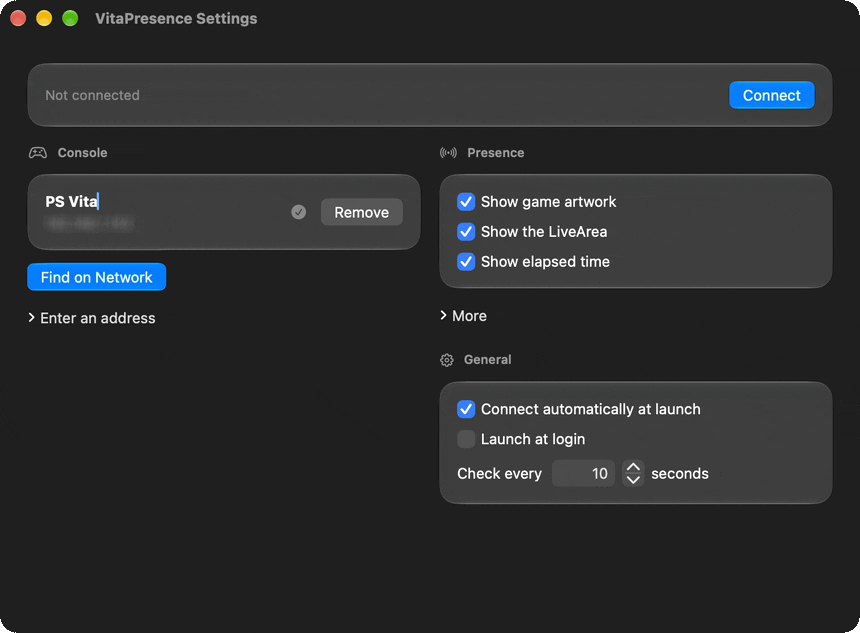
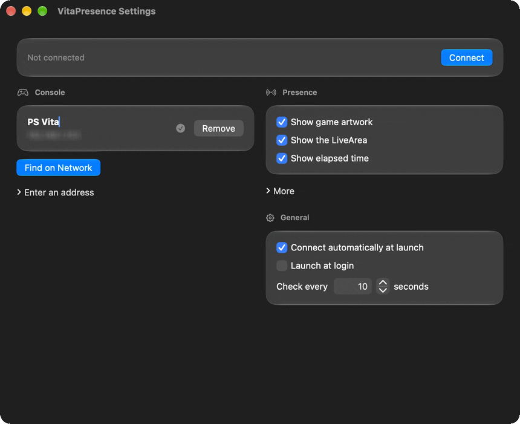
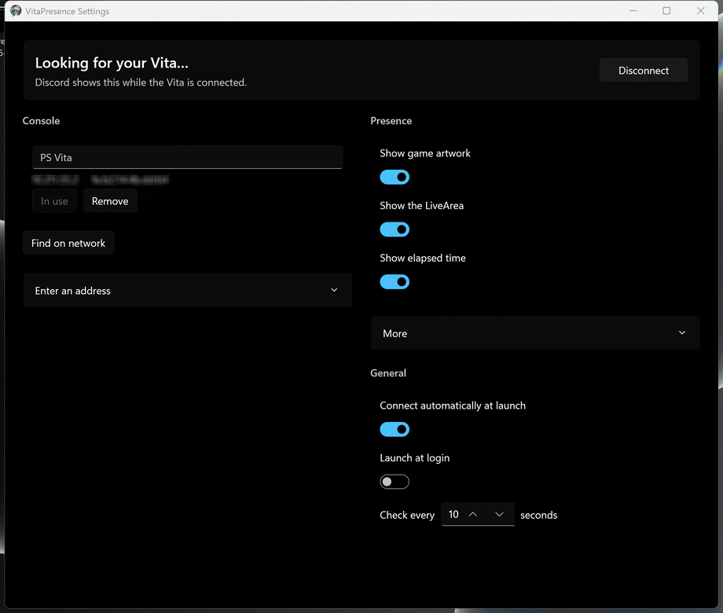
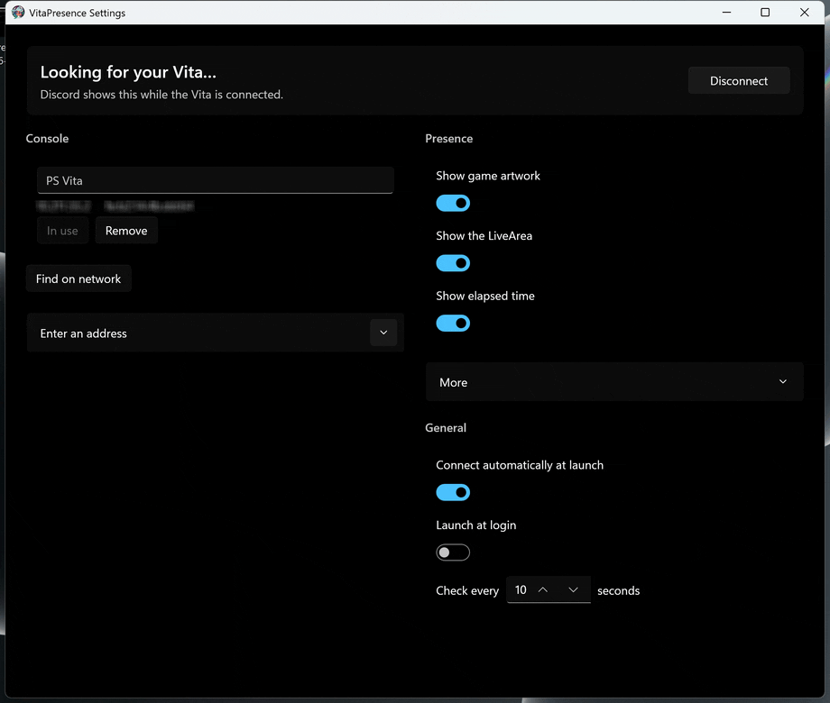

# VitaPresence

Show the game you're playing on a PS Vita as your Discord status.

A kernel plugin on the Vita reports whichever app is in the foreground. A client on your computer asks it over Wi-Fi and passes that to the Discord desktop app: the game's name, its artwork, and how long you've been playing. It works with Vita games, homebrew, and PSP and PS1 games running in Adrenaline.

The client has to be running, and the computer has to be on the same network as the Vita. Discord's desktop app has to be running too. Discord in a browser can't show this.

## The Vita plugin

Copy `VitaPresence.skprx` into `ux0:tai/` and add it under `*KERNEL` in `ux0:tai/config.txt`, then reboot the Vita.

```
*KERNEL
ux0:tai/VitaPresence.skprx
```

Use v1.1 from the [releases](https://github.com/AegiosOT/VitaDiscordPresence/releases). It also sends the game's PlayStation Store content ID, which is how the app shows the store picture. The original [v1.0 plugin](https://github.com/Electry/VitaPresence/releases) still works; the app then looks the game up by name.

## macOS

The Mac app lives in the menu bar. It finds the Vita on your network by itself, and it ships with a Discord application, so you don't create one in the Developer Portal and you don't have to type an address.



The window is a single page. Along the top is the status Discord will show, and a Connect or Disconnect button. **Console** is the Vita it remembers. **Presence** and **General** are what friends see, and when the app connects.



**More** is optional: a custom image in place of the game's artwork, a line of state text, or your own Discord application.

### Install

macOS 13 or later, Apple silicon or Intel. Homebrew builds the app, which needs Xcode 16 or later:

```sh
brew tap aegiosot/vitapresence https://github.com/AegiosOT/VitaDiscordPresence
brew install --HEAD vitapresence
vitapresence
```

Open VitaPresence and click **Allow** when macOS asks about the local network. That's how it finds the Vita.

`VitaPresence.app` is also on the [releases](https://github.com/AegiosOT/VitaDiscordPresence/releases) page. Move it to your Applications folder.

Wake the Vita and start a game. The first search can take a few seconds; after that it asks the Vita directly.

Artwork, the command-line client, and troubleshooting are in [mac/README.md](mac/README.md).

## Windows

The Windows app does the same job. It sits in the notification area, finds the Vita on the network, and uses the same built-in Discord application. Closing the window leaves it running; Quit on the tray menu exits.



The window is a single page, with the same controls as the Mac app.



**More** is optional here too: a custom image, a line of state text, or your own Discord application.

### Install

Windows 10 or later. There is no installer yet: [build the app](build.md#windows) and run it. A `Config.json` left beside the old Windows client is read once. Its address becomes a saved Vita, and a client ID becomes your own Discord application.

## Credits

- [Electry](https://github.com/Electry) for the original VitaPresence plugin and Windows client
- [Sun-Research-University](https://github.com/Sun-Research-University) for the idea and the desktop app it grew out of ([SwitchPresence](https://github.com/Sun-Research-University/SwitchPresence-Rewritten))
- Game artwork: the PlayStation Store, [HexFlow-Covers](https://github.com/Andiweli/HexFlow-Covers) by Andiweli ([CC BY-NC-SA 4.0](https://creativecommons.org/licenses/by-nc-sa/4.0/)), and [NeoVitaDB](https://github.com/robin994/NeoVitaDB-Catalog) by robin994

Building from source is in [build.md](build.md).
